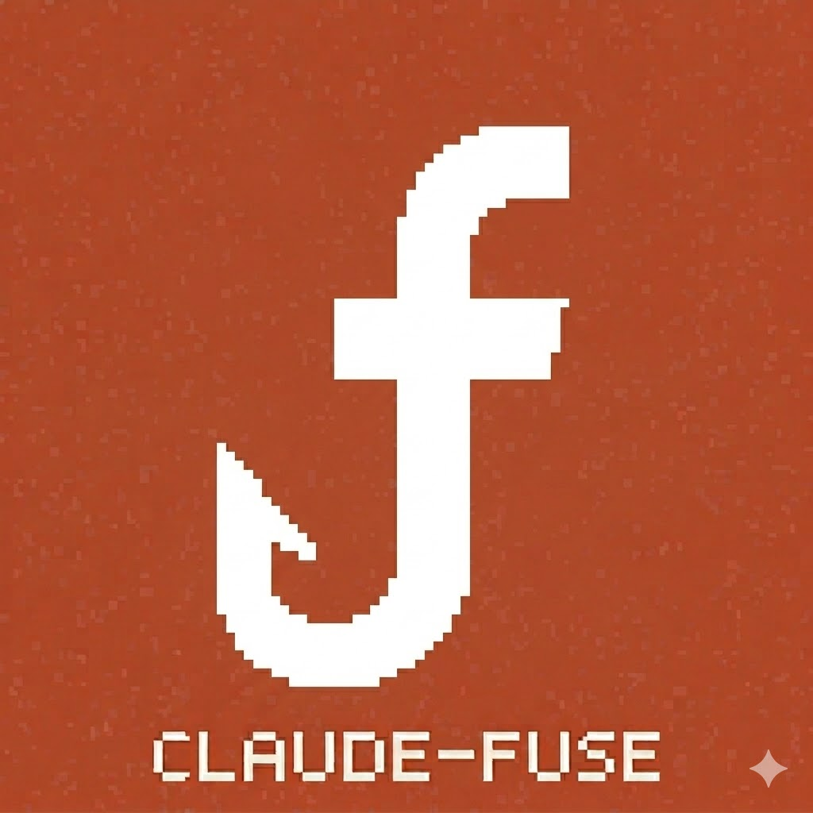

# claude-fuse

A comprehensive set of Claude Code hooks for capturing telemetry, usage metrics, and conversation traces using Langfuse. These hooks provide complete observability into your Claude Code sessions, including session lifecycle, conversation turns, tool usage, and subagent execution.

## Overview

This repository provides Python-based hooks that integrate with Langfuse to track and analyze Claude Code interactions. The hooks capture detailed information about:

- Session lifecycle (start/end events with duration and turn counts)
- Conversation turns (user prompts, assistant responses, and tool calls)
- Tool usage patterns (which tools are called, inputs, and outputs)
- Subagent execution (Task agent lifecycle and performance)
- Model usage and metadata

All captured data is sent to Langfuse where you can visualize, analyze, and monitor your Claude Code usage in real-time.

## Claude Code Hooks

### 1. SessionStart Hook

**File**: `hooks/langfuse_session_start_hook.py`

**Trigger**: Runs when a new Claude Code session starts.

**What it does**:
- Creates a "Session Start" span in Langfuse with session metadata
- Records the session source (startup, resume, etc.)
- Captures the working directory and model information
- Initializes session state tracking for later hooks

**Langfuse metadata**:
- `event`: "session_start"
- `start_source`: How the session was initiated
- `model`: The Claude model being used
- `cwd`: Current working directory

### 2. SessionEnd Hook

**File**: `hooks/langfuse_session_end_hook.py`

**Trigger**: Runs when a Claude Code session ends.

**What it does**:
- Creates a "Session End" span in Langfuse
- Calculates total session duration
- Records total number of turns in the session
- Captures the reason for session termination
- Cleans up session state

**Langfuse output**:
- `status`: "session_ended"
- `reason`: Why the session ended
- `total_turns`: Number of conversation turns
- `duration_seconds`: Total session duration

### 3. Stop Hook

**File**: `hooks/langfuse_stop_hook.py`

**Trigger**: Runs after each Claude response (after every turn).

**What it does**:
- Parses the conversation transcript to extract new turns since last run
- Creates detailed Langfuse traces for each turn containing:
  - User prompt
  - Assistant response
  - All tool calls made during the turn
  - Tool inputs and outputs
- Maintains state to track which lines have been processed
- Implements streaming to handle large transcript files efficiently

**Langfuse trace structure**:
- Turn-level span with user input and assistant output
- Generation observation with model information
- Individual tool spans for each tool call
- Complete input/output capture for debugging

**Performance**:
- Streams transcript files to avoid memory issues
- Implements timeout handling for network operations
- Logs warnings if processing takes longer than 3 minutes

### 4. SubagentStart Hook

**File**: `hooks/langfuse_subagent_start_hook.py`

**Trigger**: Runs when a Task agent (subagent) is launched.

**What it does**:
- Creates a "Subagent Start" span in Langfuse
- Records the agent type (Bash, Explore, Plan, etc.)
- Tracks the agent ID for later correlation
- Updates session state with subagent information

**Langfuse metadata**:
- `event`: "subagent_start"
- `agent_type`: Type of agent being launched
- `agent_id`: Unique identifier for this agent instance

### 5. SubagentStop Hook

**File**: `hooks/langfuse_subagent_stop_hook.py`

**Trigger**: Runs when a Task agent completes.

**What it does**:
- Parses the subagent's complete transcript
- Creates traces for all turns within the subagent execution
- Prefixes subagent traces with `[agent_type]` for easy identification
- Calculates subagent execution duration
- Records total turns processed by the subagent
- Cleans up subagent state

**Langfuse output**:
- `status`: "subagent_stopped"
- `agent_type`: Type of agent that stopped
- `total_turns`: Number of turns processed by subagent
- `duration_seconds`: How long the subagent ran

**Trace prefixes**: Subagent traces are labeled with `[Bash]`, `[Explore]`, `[Plan]`, etc. to distinguish them from main session traces.

## Common Infrastructure

### common.py

Provides shared utilities used by all hooks:

- **State management**: Load/save session state with file locking
- **Logging**: Centralized logging to `~/.claude/state/langfuse_hook.log` (or configured log directory)
- **Input parsing**: Read and validate JSON hook input from stdin
- **Langfuse client**: Initialize authenticated Langfuse client
- **Message parsing**: Extract content, tool calls, and text from transcript messages
- **Error handling**: Comprehensive timeout and fault tolerance

### transcript.py

Handles transcript parsing and trace creation:

- **Turn parsing**: Groups transcript messages into user/assistant turns
- **Message merging**: Combines streaming assistant response chunks
- **Trace creation**: Builds structured Langfuse traces with generations and tool spans
- **Error recovery**: Robust error handling for malformed transcript data

## Setup and Configuration

### Prerequisites

- [uv](https://github.com/astral-sh/uv) package manager (required)
  - Unix: `curl -LsSf https://astral.sh/uv/install.sh | sh`
  - Windows: `powershell -c "irm https://astral.sh/uv/install.ps1 | iex"`
- A [Langfuse](https://langfuse.com/) account (free tier available)
- Claude Code CLI

> **Note:** Hooks only run in **trusted workspaces**. If hooks appear to be silently ignored, check your workspace trust settings.

### Installation

#### Plugin Install (Recommended)

Install claude-fuse as a Claude Code plugin — no manual configuration needed:

1. Add the marketplace:
   ```
   /plugin marketplace add RockManJoe64/claude-fuse
   ```

2. Install the plugin:
   ```
   /plugin install claude-fuse@RockManJoe64/claude-fuse
   ```

3. Set your Langfuse environment variables. You can place these in your shell profile, `.claude/settings.local.json`, direnv, or wherever you manage env vars:
   ```
   LANGFUSE_PUBLIC_KEY=pk-lf-...
   LANGFUSE_SECRET_KEY=sk-lf-...
   LANGFUSE_HOST=https://cloud.langfuse.com
   ```

4. Start a new Claude Code session — hooks will activate automatically.

#### Advanced: Manual Setup

If you prefer to wire hooks manually (e.g., for customization or debugging):

1. Clone this repository:
   ```bash
   git clone https://github.com/RockManJoe64/claude-fuse.git
   cd claude-fuse
   ```

2. Install dev dependencies:
   ```bash
   uv sync
   ```

3. Copy the example settings file to your project or user config:
   ```bash
   cp settings.example.json /path/to/your/project/.claude/settings.local.json
   ```

4. Edit the copied file and replace the placeholder API keys with your actual Langfuse credentials.

### Getting Langfuse API Keys

1. Sign up for a free account at [langfuse.com](https://langfuse.com/)
2. Create a new project in the Langfuse dashboard
3. Navigate to Settings > API Keys
4. Copy your Public Key (starts with `pk-lf-`)
5. Copy your Secret Key (starts with `sk-lf-`)
6. Note your Langfuse host URL:
   - US Cloud: `https://us.cloud.langfuse.com`
   - EU Cloud: `https://cloud.langfuse.com`
   - Self-hosted: Your custom URL

### Configuration Options

#### Environment Variables

Set these in your `.claude/settings.json` or `.claude/settings.local.json`:

- **TRACE_TO_LANGFUSE** (required): Set to `"true"` to enable tracing
- **LANGFUSE_PUBLIC_KEY** (required): Your Langfuse public API key
- **LANGFUSE_SECRET_KEY** (required): Your Langfuse secret API key
- **LANGFUSE_HOST** (optional): Langfuse server URL (defaults to `https://cloud.langfuse.com`)
- **CC_LANGFUSE_DEBUG** (optional): Set to `"true"` to enable debug logging
- **CC_LANGFUSE_USER_ID** (optional): Explicit user identifier sent to Langfuse for per-user analytics. If not set, auto-detected via: `LANGFUSE_USER_ID` env var → git config email → git config name → OS username → `"unknown"`.

You can also use the `CC_LANGFUSE_*` prefixed versions of the keys:
- `CC_LANGFUSE_PUBLIC_KEY`
- `CC_LANGFUSE_SECRET_KEY`
- `CC_LANGFUSE_HOST`

#### Hook Configuration

Each hook can be enabled/disabled independently in your settings file. Remove a hook from the configuration to disable it.

#### Debugging

Enable debug logging to troubleshoot issues:

```json
{
  "env": {
    "CC_LANGFUSE_DEBUG": "true"
  }
}
```

Debug logs are written to `~/.claude/state/langfuse_hook.log`

## Viewing Your Data in Langfuse

Once configured, your Claude Code sessions will automatically appear in your Langfuse dashboard:

1. **Traces**: View individual conversation turns with complete tool call details
2. **Sessions**: Group traces by Claude Code session using the session_id
3. **Analytics**: Track usage patterns, model performance, and tool usage
4. **Debugging**: Inspect full input/output for each turn to debug issues

### Example Langfuse Views

- Filter by `source: "claude-code"` to see all Claude Code traces
- Use session_id to group related traces
- Filter by `event: "subagent_start"` to find Task agent usage
- Search by tool names to analyze specific tool patterns

## Architecture

```
Claude Code Session
├── SessionStart Hook → Langfuse "Session Start" span
├── Stop Hook (after each turn)
│   ├── Parse transcript
│   └── Create traces with:
│       ├── User input
│       ├── Assistant response
│       └── Tool calls (with inputs/outputs)
├── SubagentStart Hook → Langfuse "Subagent Start" span
├── SubagentStop Hook
│   ├── Parse subagent transcript
│   └── Create prefixed traces: [AgentType] Turn N
└── SessionEnd Hook → Langfuse "Session End" span
```

## Troubleshooting

### Hooks Not Running

1. Check that `TRACE_TO_LANGFUSE=true` is set in your environment
2. Verify hooks are configured in your settings.json
3. Check `~/.claude/state/langfuse_hook.log` for error messages
4. Ensure uv is installed and in your PATH

### Missing Traces in Langfuse

1. Verify your API keys are correct
2. Check network connectivity to Langfuse host
3. Look for timeout errors in the log file
4. Enable debug logging with `CC_LANGFUSE_DEBUG=true`

### Performance Issues

1. The Stop hook may take longer on large transcripts (handled gracefully)
2. Hooks have built-in timeout handling to avoid blocking Claude Code
3. Check logs for warnings about processing time >3 minutes

## Contributing

Contributions are welcome! Please open an issue or submit a pull request.

## License

See LICENSE file for details.

## Related Links

- [Claude Code Documentation](https://docs.anthropic.com/claude-code)
- [Langfuse Documentation](https://langfuse.com/docs)
- [Claude Code Hooks Guide](https://docs.anthropic.com/claude-code/docs/hooks)
